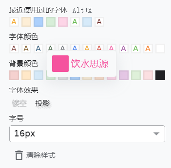
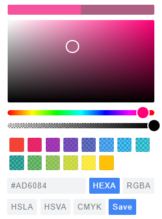
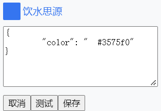
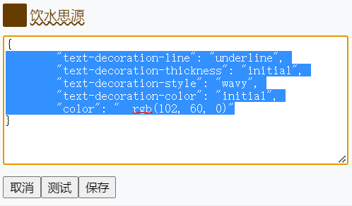
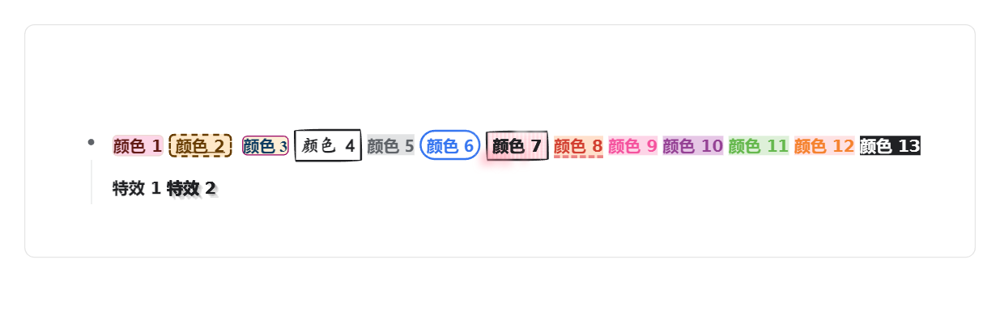
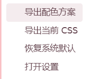
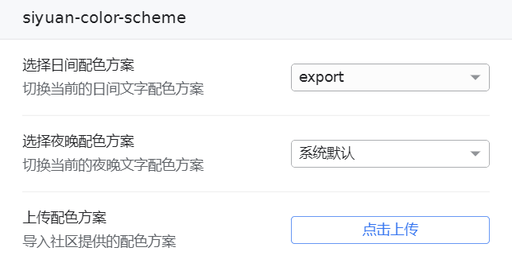

### Start

This is a control plugin for the Source Han Sans font, which has the following features:

* Allow arbitrary changes to the font color in SiYuan.
* Support customization of font, size, color, and style for display, allowing you to add your favorite font to SiYuan and enjoy better typesetting effects.
* Maintain customized font display effects across themes.
* Adapt to the switch between day and night modes, allowing you to have different color schemes in the two modes.
* Change the image export effects and modify the pdf and html export effects through certain operations.
* Export and import color schemes and share them with the community.

### Function Introduction

#### Change the font color in SiYuan.

​​​​

Open the font selection interface, choose the font you wish to modify, right-click, and you will see the following menu appear.

​​

On the left are color blocks, and on the right is the font preview. Click on the color blocks on the left to enter color adjustment mode:

​​

After selecting the favorite color, click "save" to save the font color.

#### Customize font, size, color, and style of display.

​​

Open the font selection interface, choose the font you wish to modify, right-click, and you will see the following menu appear.

​​

The left side is the color palette, and the right side is the font preview. Click on the font preview on the left to enter advanced mode:

​​

This is a control interface for CSS syntax, where you can freely use CSS syntax to control font effects.

​​

After completing the writing, click **test** to preview the font settings. At this time, the display effect of the font is limited to the preview and will not affect the display in the SiYuan text.

​​

After being satisfied with the testing results, you can click "Save" to save the font settings and formally apply them to SiYuan.

#### Cross-Theme

Customized fonts will remain consistent across different themes, while non-customized fonts will be consistent with the theme settings.

### Day/Night mode switching

The font set in the plugin settings will only apply to the current mode, which allows you to use different fonts in the day and night modes.

### Change Export Results

You don't need to take any special actions to change the exported results of the image.

​​

​​

However, for exporting to PDF and HTML, due to the limitations of SiYuan, further action is required to export the font effects.

First, find the plugin icon located in the upper-right corner of Source Han Sans, click on it, and the plugin menu will appear.

​​

When you select **Export current CSS**, a CSS file will be generated and the export location will be indicated in the notification.

​​

Find the CSS in the corresponding location, copy the content to the end of the "theme.css" file that is currently being used, and the font style will be exported to both PDF and HTML.

​​

#### Export and import color schemes.

First, find the plugin icon located in the upper-right corner of Source Han Sans, click on it, and the plugin menu will appear.

​​

When you select **Export Color Scheme**, a JSON file will be generated and the export location will be notified in the notification.

​​

你可以把这个配色方案保存起来，或分享到社区，分享前，记得修改json文件中的name。

You can save this color scheme or share it with the community. Before sharing, remember to modify the "name" in the JSON file.

By selecting "Open Settings", you can enter the settings interface of the plugin.

​​

使用上传配色方案上传的配色方案会出现在上方的选择框中，你可以自由选择。

The color schemes uploaded using the upload function will appear in the selection box above, and you can freely choose.

**Note**: selecting a color scheme will remove your current custom color scheme, so please remember to save!

#### Restore Defaults

You can select the "系统默认" color scheme from the "Restore default system settings" option in the menu and Settings interface to restore the theme's color scheme.

### Thanksgiving List

* [Custom inline font color and background color that can be applied across multiple themes in Boostnote - Chain Drop](https://ld246.com/article/1682000853320)
* [Record of Boostnote tinkering - HTML blocks - Theme CSS color selectors - Chain Drop](https://ld246.com/article/1682283088286)
* Framework by [zuoez02](https://ld246.com/member/zuoez02).
* This readme includes a color scheme from [PinkX-room](https://github.com/chenshinshi/PinkX-room), many thanks to [chenshinshi](https://github.com/chenshinshi) for sharing.

Result and JSON as follows:

​​

```json
{
	"name": "export",
	"light": {
		"font-color1": {
			"background-color": "rgba(255, 167, 172, 0.6)",
			"border-top-color": "rgb(254, 207, 209)",
			"border-right-color": "rgb(254, 207, 209)",
			"border-bottom-color": "rgb(254, 207, 209)",
			"border-left-color": "rgb(254, 207, 209)",
			"border-top-width": "4px",
			"border-right-width": "0px",
			"border-bottom-width": "4px",
			"border-left-width": "0px",
			"border-top-style": "solid",
			"border-right-style": "solid",
			"border-bottom-style": "solid",
			"border-left-style": "solid"
		},
		"font-color2": {
			"text-decoration-line": "underline",
			"text-decoration-thickness": "initial",
			"text-decoration-style": "wavy",
			"text-decoration-color": "initial"
		},
		"font-color3": {
			"font-family": "\"Times New Roman\""
		},
		"font-color4": {
			"font-size": "110%",
			"font-family": "楷体"
		},
		"font-color5": {
			"font-family": "Aa漫语手写体（简繁）"
		},
		"font-color6": {
			"font-family": "TH-Sung-TP2, TH-Sung-TP0"
		},
		"font-color7": {
			"background-image": "linear-gradient(104deg, rgba(255, 147, 166, 0) 0.9%, rgb(255, 147, 166) 2.4%, rgba(255, 147, 166, 0.5) 5.8%, rgba(255, 147, 166, 0.1) 93%, rgba(255, 147, 166, 0.7) 96%, rgba(255, 147, 166, 0) 98%), linear-gradient(183deg, rgba(255, 147, 166, 0) 0%, rgba(255, 147, 166, 0.3) 7.9%, rgba(255, 147, 166, 0) 15%)",
			"background-color": "initial",
			"padding-top": "0.2em",
			"padding-right": "0.3em",
			"padding-bottom": "0.2em",
			"padding-left": "0.3em",
			"-webkit-box-decoration-break": "clone",
			"margin-top": "0px",
			"margin-right": "0px",
			"margin-bottom": "0px",
			"margin-left": "0px",
			"border-top-left-radius": "7.5px",
			"border-top-right-radius": "7.5px",
			"border-bottom-right-radius": "7.5px",
			"border-bottom-left-radius": "7.5px",
			"text-shadow": "rgba(255, 147, 166, 0.7) -12px 12px 9.8px, rgb(255, 255, 255) 21px -18.1px 7.3px, rgb(255, 255, 255) -18.1px -27.3px 30px"
		},
		"font-color8": {
			"border-bottom-width": "3px",
			"border-bottom-style": "dashed",
			"border-bottom-color": "rgb(235, 131, 131)"
		},
		"font-background7": {
			"background-color": "rgba(255, 255, 255, 0)",
			"background-size": "4px 3px",
			"border-top-style": "solid",
			"border-right-style": "solid",
			"border-bottom-style": "solid",
			"border-left-style": "solid",
			"border-top-width": "2px",
			"border-right-width": "2px",
			"border-bottom-width": "2px",
			"border-left-width": "2px",
			"box-shadow": "rgba(0, 0, 0, 0.2) 15px 28px 25px -18px",
			"box-sizing": "border-box",
			"color": "inherit",
			"cursor": "pointer",
			"padding-top": "0em",
			"padding-right": "0.3em",
			"padding-bottom": "0em",
			"padding-left": "0.3em",
			"display": "inline-block",
			"transition-duration": "235ms",
			"transition-timing-function": "ease-in-out",
			"transition-delay": "0s",
			"transition-property": "all",
			"border-bottom-left-radius": "15px 255px",
			"border-bottom-right-radius": "225px 15px",
			"border-top-left-radius": "255px 15px",
			"border-top-right-radius": "15px 225px"
		},
		"font-background6": {
			"background-color": "rgba(255, 255, 255, 0)",
			"border-top-width": "2px",
			"border-right-width": "2px",
			"border-bottom-width": "2px",
			"border-left-width": "2px",
			"border-top-style": "solid",
			"border-right-style": "solid",
			"border-bottom-style": "solid",
			"border-left-style": "solid",
			"border-top-color": "initial",
			"border-right-color": "initial",
			"border-bottom-color": "initial",
			"border-left-color": "initial",
			"border-image-source": "initial",
			"border-image-slice": "initial",
			"border-image-width": "initial",
			"border-image-outset": "initial",
			"border-image-repeat": "initial",
			"border-top-left-radius": "30px",
			"border-top-right-radius": "30px",
			"border-bottom-right-radius": "30px",
			"border-bottom-left-radius": "30px",
			"box-shadow": "3px 3px 0px 0px",
			"cursor": "pointer",
			"display": "inline-block",
			"padding-top": "0px",
			"padding-right": "0.3em",
			"padding-bottom": "0px",
			"padding-left": "0.3em"
		},
		"font-background5": {
			"border-top-color": "rgb(239, 222, 222)",
			"border-right-color": "rgb(239, 222, 222)",
			"border-bottom-color": "rgb(239, 222, 222)",
			"border-left-color": "rgb(239, 222, 222)",
			"border-top-width": "1px",
			"border-right-width": "1px",
			"border-bottom-width": "1px",
			"border-left-width": "1px"
		},
		"font-background4": {
			"margin-top": "3px",
			"margin-right": "5px",
			"margin-bottom": "3px",
			"margin-left": "5px",
			"padding-top": "6px",
			"padding-right": "6px",
			"padding-bottom": "0px",
			"padding-left": "6px",
			"box-shadow": "rgba(182, 149, 151, 0.25) 0px 14px 28px, rgba(182, 149, 151, 0.22) 0px 10px 10px, rgba(182, 149, 151, 0.6) 1px 2px 2px 1px",
			"font-size": "90%",
			"background-image": "initial",
			"background-position-x": "initial",
			"background-position-y": "initial",
			"background-size": "initial",
			"background-repeat-x": "initial",
			"background-repeat-y": "initial",
			"background-attachment": "initial",
			"background-origin": "initial",
			"background-clip": "initial",
			"background-color": "rgba(228, 171, 175, 0.75)"
		},
		"font-background3": {
			"border-top-left-radius": "5px",
			"border-top-right-radius": "5px",
			"border-bottom-right-radius": "5px",
			"border-bottom-left-radius": "5px",
			"border-top-color": "rgb(150, 0, 100)",
			"border-right-color": "rgb(150, 0, 100)",
			"border-bottom-color": "rgb(150, 0, 100)",
			"border-left-color": "rgb(150, 0, 100)",
			"border-top-width": "1px",
			"border-right-width": "1px",
			"border-bottom-width": "1px",
			"border-left-width": "1px",
			"border-top-style": "solid",
			"border-right-style": "solid",
			"border-bottom-style": "solid",
			"border-left-style": "solid",
			"background-color": "rgb(253, 238, 214)"
		},
		"font-background2": {
			"border-top-left-radius": "5px",
			"border-top-right-radius": "5px",
			"border-bottom-right-radius": "5px",
			"border-bottom-left-radius": "5px",
			"padding-top": "0em",
			"padding-right": "0.3em",
			"padding-bottom": "0em",
			"padding-left": "0.3em",
			"border-top-color": "inherit",
			"border-right-color": "inherit",
			"border-bottom-color": "inherit",
			"border-left-color": "inherit",
			"border-top-width": "2px",
			"border-right-width": "2px",
			"border-bottom-width": "2px",
			"border-left-width": "2px",
			"border-top-style": "dashed",
			"border-right-style": "dashed",
			"border-bottom-style": "dashed",
			"border-left-style": "dashed"
		},
		"font-background1": {
			"border-top-left-radius": "5px",
			"border-top-right-radius": "5px",
			"border-bottom-right-radius": "5px",
			"border-bottom-left-radius": "5px",
			"border-top-color": "rgb(237, 217, 210)",
			"border-right-color": "rgb(237, 217, 210)",
			"border-bottom-color": "rgb(237, 217, 210)",
			"border-left-color": "rgb(237, 217, 210)",
			"border-top-width": "1px",
			"border-right-width": "1px",
			"border-bottom-width": "1px",
			"border-left-width": "1px",
			"border-top-style": "solid",
			"border-right-style": "solid",
			"border-bottom-style": "solid",
			"border-left-style": "solid",
			"background-color": "rgb(253, 213, 231)"
		}
	},
	"dark": {}
}
```
