### 开始

如果图片加载异常，可以在[链滴社区](https://ld246.com/article/1684065818123)中查看

这是一个思源字体的控制插件，它具有以下几个功能：

* 随意更改思源中字体颜色
* 支持自定义显示的字体、大小、颜色和样式，你可以将自己喜欢的字体添加到思源中，享受更好的排版效果。
* 跨主题保持自定义的字体显示效果。
* 适配日夜模式切换，允许你在两种模式下拥有不同的配色方案。
* 能改变图片导出效果，经过一定操作能改变pdf、html导出效果。
* 导出、导入配色方案，在社区中分享配色方案

### 功能介绍

#### 更改思源中字体颜色

​​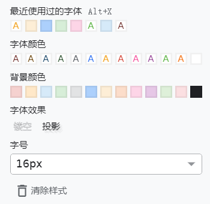​​

打开字体的选择界面，选择你希望修改的字体，右键点击，可以见到出现了如下所示的菜单。

​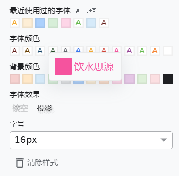​

左边是调色块，右边是字体预览。点击左边的调色块进入调色模式：

​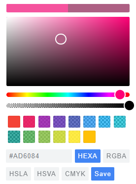​

选中喜欢的颜色后点击save，就能保存字体颜色。

#### 自定义显示的字体、大小、颜色和样式

​​

打开字体的选择界面，选择你希望修改的字体，右键点击，可以见到出现了如下所示的菜单。

​​

左边是调色块，右边是字体预览。点击左边的字体预览进入高级模式：

​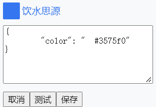​

这是一个css语法的控制界面，你可以随意使用css语法来控制字体效果。

​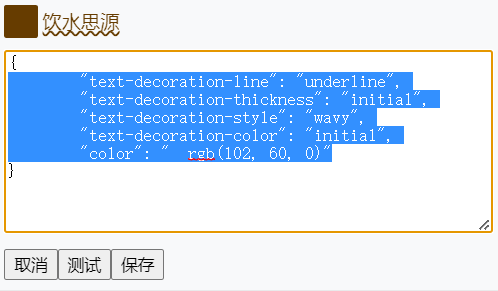​

编写完成后，点击 **测试 ​**可以在字体预览中查看字体设置的效果，此时字体的显示效果仅局限于预览中，不会改变思源正文中的显示。

​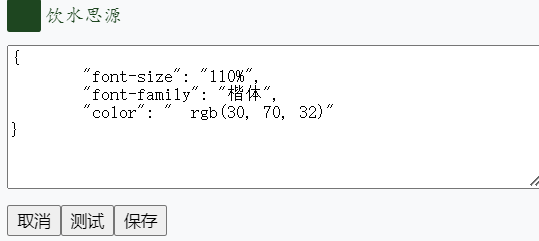​

测试效果满意后，就可以点击 **保存 ​**可以将字体的设置保存下来，并正式应用到思源中。

#### 跨主题

自定义后的字体在不同主题会保存相同显示，未自定义的字体则与主题设置一致。

#### 日夜模式切换

插件设置的字体只会应用到当前模式下，这允许你在日夜两种模式下使用不同的字体。

#### 改变导出效果

不需要特意操作，就可以改变图片的导出效果

​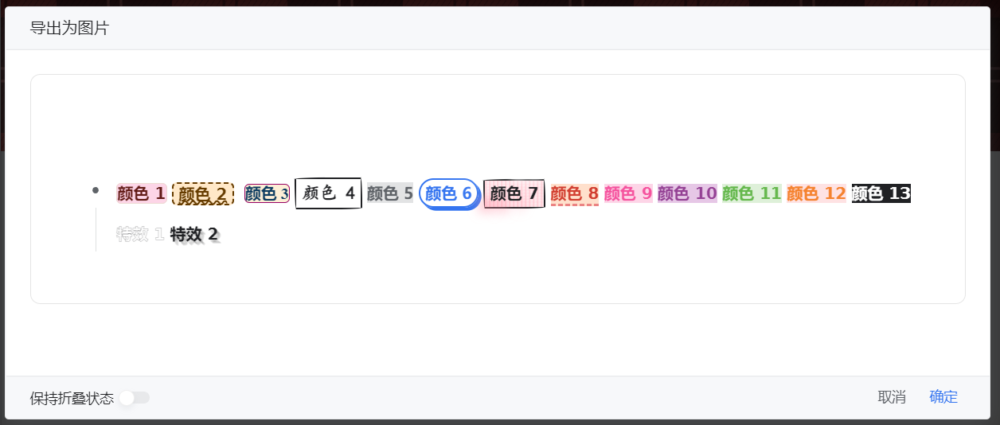​

​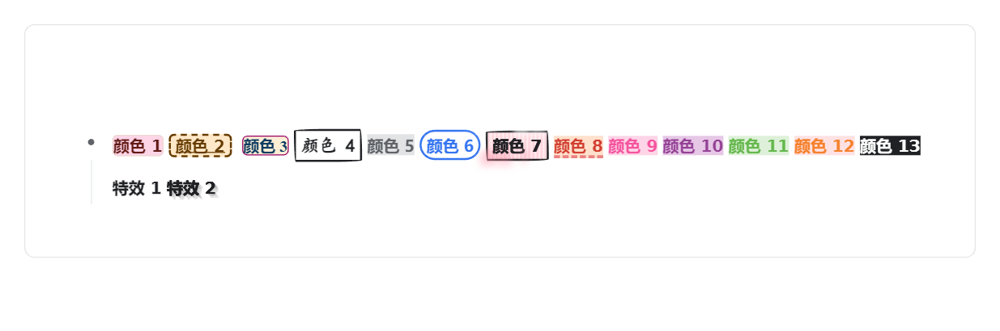​

但是对于pdf和html的导出，由于思源的限制，需要进行进一步操作才能导出字体效果。

首先，在思源的右上方找到插件的图标，点击，出现插件的菜单。

​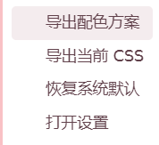​

选中 **导出当前 CSS**，就会生成一个CSS文件，并在通知中告知导出位置。

​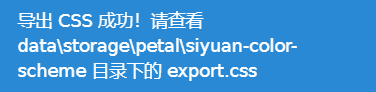​

在相应的位置找到css，将内容复制到当前使用的主题的theme.css的末尾，就能把字体样式导出到pdf和html中了。

​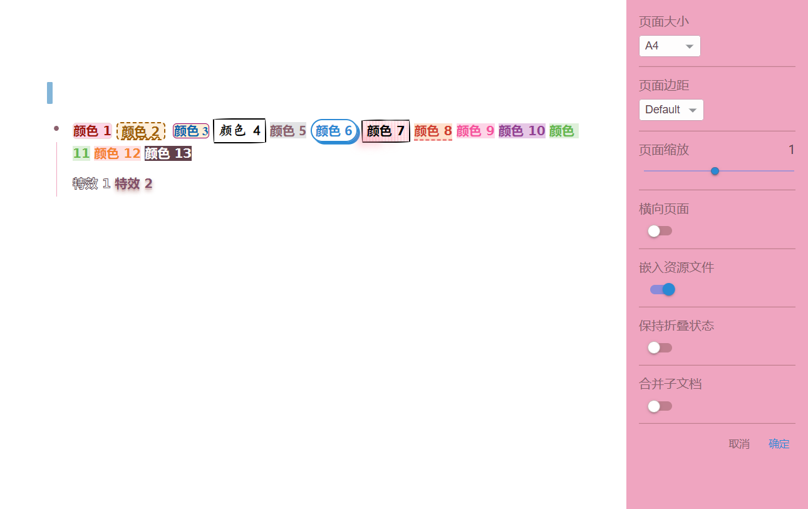​

#### 导出、导入配色方案

首先，在思源的右上方找到插件的图标，点击，出现插件的菜单。

​​

选中 **导出配色方案**，就会生成一个json文件，并在通知中告知导出位置。

​​

你可以把这个配色方案保存起来，或分享到社区，分享前，记得修改json文件中的name。

选中**打开设置**，你就能进入到插件的设置界面。

​​

使用上传配色方案上传的配色方案会出现在上方的选择框中，你可以自由选择。

**注意**：选中配色方案后会清除当前的自定义配色方案，请务必记得保存！

#### 恢复默认

你可以在菜单的**恢复系统默认**和设置界面中选中**系统默认**配色方案来恢复主题的配色方案。

### 感谢名单

* [思源笔记 自定义 可在多个主题间适用的 行内字色及底色 - 链滴](https://ld246.com/article/1682000853320)
* [思源笔记折腾记录 -html 块 - 主题 css 颜色选择器 - 链滴](https://ld246.com/article/1682283088286)
* [zuoez02](https://ld246.com/member/zuoez02) 的框架。
* 在这份readme中附带了一份配色方案，来自于[PinkX-room ](https://github.com/chenshinshi/PinkX-room)，万分感谢[chenshinshi](https://github.com/chenshinshi)的分享。

效果和json见下：

​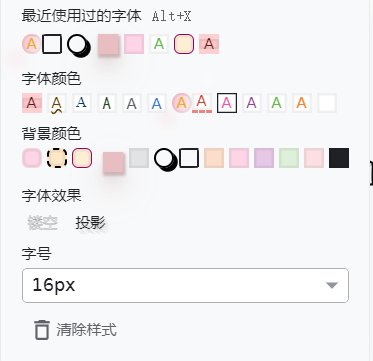​

```json
{
	"name": "export",
	"light": {
		"font-color1": {
			"background-color": "rgba(255, 167, 172, 0.6)",
			"border-top-color": "rgb(254, 207, 209)",
			"border-right-color": "rgb(254, 207, 209)",
			"border-bottom-color": "rgb(254, 207, 209)",
			"border-left-color": "rgb(254, 207, 209)",
			"border-top-width": "4px",
			"border-right-width": "0px",
			"border-bottom-width": "4px",
			"border-left-width": "0px",
			"border-top-style": "solid",
			"border-right-style": "solid",
			"border-bottom-style": "solid",
			"border-left-style": "solid"
		},
		"font-color2": {
			"text-decoration-line": "underline",
			"text-decoration-thickness": "initial",
			"text-decoration-style": "wavy",
			"text-decoration-color": "initial"
		},
		"font-color3": {
			"font-family": "\"Times New Roman\""
		},
		"font-color4": {
			"font-size": "110%",
			"font-family": "楷体"
		},
		"font-color5": {
			"font-family": "Aa漫语手写体（简繁）"
		},
		"font-color6": {
			"font-family": "TH-Sung-TP2, TH-Sung-TP0"
		},
		"font-color7": {
			"background-image": "linear-gradient(104deg, rgba(255, 147, 166, 0) 0.9%, rgb(255, 147, 166) 2.4%, rgba(255, 147, 166, 0.5) 5.8%, rgba(255, 147, 166, 0.1) 93%, rgba(255, 147, 166, 0.7) 96%, rgba(255, 147, 166, 0) 98%), linear-gradient(183deg, rgba(255, 147, 166, 0) 0%, rgba(255, 147, 166, 0.3) 7.9%, rgba(255, 147, 166, 0) 15%)",
			"background-color": "initial",
			"padding-top": "0.2em",
			"padding-right": "0.3em",
			"padding-bottom": "0.2em",
			"padding-left": "0.3em",
			"-webkit-box-decoration-break": "clone",
			"margin-top": "0px",
			"margin-right": "0px",
			"margin-bottom": "0px",
			"margin-left": "0px",
			"border-top-left-radius": "7.5px",
			"border-top-right-radius": "7.5px",
			"border-bottom-right-radius": "7.5px",
			"border-bottom-left-radius": "7.5px",
			"text-shadow": "rgba(255, 147, 166, 0.7) -12px 12px 9.8px, rgb(255, 255, 255) 21px -18.1px 7.3px, rgb(255, 255, 255) -18.1px -27.3px 30px"
		},
		"font-color8": {
			"border-bottom-width": "3px",
			"border-bottom-style": "dashed",
			"border-bottom-color": "rgb(235, 131, 131)"
		},
		"font-background7": {
			"background-color": "rgba(255, 255, 255, 0)",
			"background-size": "4px 3px",
			"border-top-style": "solid",
			"border-right-style": "solid",
			"border-bottom-style": "solid",
			"border-left-style": "solid",
			"border-top-width": "2px",
			"border-right-width": "2px",
			"border-bottom-width": "2px",
			"border-left-width": "2px",
			"box-shadow": "rgba(0, 0, 0, 0.2) 15px 28px 25px -18px",
			"box-sizing": "border-box",
			"color": "inherit",
			"cursor": "pointer",
			"padding-top": "0em",
			"padding-right": "0.3em",
			"padding-bottom": "0em",
			"padding-left": "0.3em",
			"display": "inline-block",
			"transition-duration": "235ms",
			"transition-timing-function": "ease-in-out",
			"transition-delay": "0s",
			"transition-property": "all",
			"border-bottom-left-radius": "15px 255px",
			"border-bottom-right-radius": "225px 15px",
			"border-top-left-radius": "255px 15px",
			"border-top-right-radius": "15px 225px"
		},
		"font-background6": {
			"background-color": "rgba(255, 255, 255, 0)",
			"border-top-width": "2px",
			"border-right-width": "2px",
			"border-bottom-width": "2px",
			"border-left-width": "2px",
			"border-top-style": "solid",
			"border-right-style": "solid",
			"border-bottom-style": "solid",
			"border-left-style": "solid",
			"border-top-color": "initial",
			"border-right-color": "initial",
			"border-bottom-color": "initial",
			"border-left-color": "initial",
			"border-image-source": "initial",
			"border-image-slice": "initial",
			"border-image-width": "initial",
			"border-image-outset": "initial",
			"border-image-repeat": "initial",
			"border-top-left-radius": "30px",
			"border-top-right-radius": "30px",
			"border-bottom-right-radius": "30px",
			"border-bottom-left-radius": "30px",
			"box-shadow": "3px 3px 0px 0px",
			"cursor": "pointer",
			"display": "inline-block",
			"padding-top": "0px",
			"padding-right": "0.3em",
			"padding-bottom": "0px",
			"padding-left": "0.3em"
		},
		"font-background5": {
			"border-top-color": "rgb(239, 222, 222)",
			"border-right-color": "rgb(239, 222, 222)",
			"border-bottom-color": "rgb(239, 222, 222)",
			"border-left-color": "rgb(239, 222, 222)",
			"border-top-width": "1px",
			"border-right-width": "1px",
			"border-bottom-width": "1px",
			"border-left-width": "1px"
		},
		"font-background4": {
			"margin-top": "3px",
			"margin-right": "5px",
			"margin-bottom": "3px",
			"margin-left": "5px",
			"padding-top": "6px",
			"padding-right": "6px",
			"padding-bottom": "0px",
			"padding-left": "6px",
			"box-shadow": "rgba(182, 149, 151, 0.25) 0px 14px 28px, rgba(182, 149, 151, 0.22) 0px 10px 10px, rgba(182, 149, 151, 0.6) 1px 2px 2px 1px",
			"font-size": "90%",
			"background-image": "initial",
			"background-position-x": "initial",
			"background-position-y": "initial",
			"background-size": "initial",
			"background-repeat-x": "initial",
			"background-repeat-y": "initial",
			"background-attachment": "initial",
			"background-origin": "initial",
			"background-clip": "initial",
			"background-color": "rgba(228, 171, 175, 0.75)"
		},
		"font-background3": {
			"border-top-left-radius": "5px",
			"border-top-right-radius": "5px",
			"border-bottom-right-radius": "5px",
			"border-bottom-left-radius": "5px",
			"border-top-color": "rgb(150, 0, 100)",
			"border-right-color": "rgb(150, 0, 100)",
			"border-bottom-color": "rgb(150, 0, 100)",
			"border-left-color": "rgb(150, 0, 100)",
			"border-top-width": "1px",
			"border-right-width": "1px",
			"border-bottom-width": "1px",
			"border-left-width": "1px",
			"border-top-style": "solid",
			"border-right-style": "solid",
			"border-bottom-style": "solid",
			"border-left-style": "solid",
			"background-color": "rgb(253, 238, 214)"
		},
		"font-background2": {
			"border-top-left-radius": "5px",
			"border-top-right-radius": "5px",
			"border-bottom-right-radius": "5px",
			"border-bottom-left-radius": "5px",
			"padding-top": "0em",
			"padding-right": "0.3em",
			"padding-bottom": "0em",
			"padding-left": "0.3em",
			"border-top-color": "inherit",
			"border-right-color": "inherit",
			"border-bottom-color": "inherit",
			"border-left-color": "inherit",
			"border-top-width": "2px",
			"border-right-width": "2px",
			"border-bottom-width": "2px",
			"border-left-width": "2px",
			"border-top-style": "dashed",
			"border-right-style": "dashed",
			"border-bottom-style": "dashed",
			"border-left-style": "dashed"
		},
		"font-background1": {
			"border-top-left-radius": "5px",
			"border-top-right-radius": "5px",
			"border-bottom-right-radius": "5px",
			"border-bottom-left-radius": "5px",
			"border-top-color": "rgb(237, 217, 210)",
			"border-right-color": "rgb(237, 217, 210)",
			"border-bottom-color": "rgb(237, 217, 210)",
			"border-left-color": "rgb(237, 217, 210)",
			"border-top-width": "1px",
			"border-right-width": "1px",
			"border-bottom-width": "1px",
			"border-left-width": "1px",
			"border-top-style": "solid",
			"border-right-style": "solid",
			"border-bottom-style": "solid",
			"border-left-style": "solid",
			"background-color": "rgb(253, 213, 231)"
		}
	},
	"dark": {}
}
```
